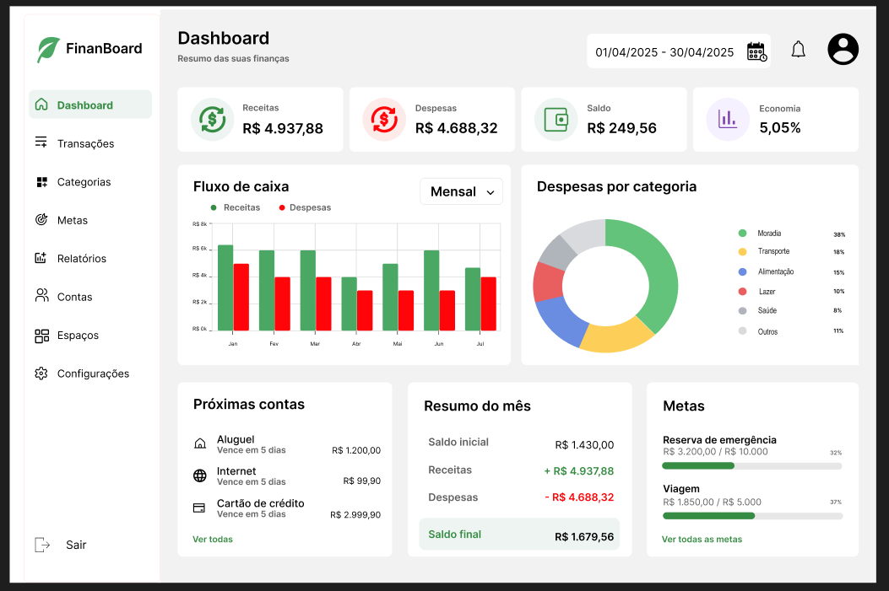

# :checkered_flag: FinanBoard

O FinanBoard é a proposta de um espaço web onde as pessoas podem registrar receitas e despesas, acompanhar seu saldo, categorizar os gastos e estabelecer metas financeiras, além de ser possível criar espaços compartilhados, onde é possível registrra uma despesa, definir quanto cada um vai pagar, e acompanhar os valores que já foram pagos ou estão pendentes.

## :technologist: Membros da equipe

Kendriks da Paixão - 497570  
Engenharia de Software

## :bulb: Objetivo Geral
Desenvolver uma aplicação web para gerenciamento de finanças pessoais e compartilhadas.

## :eyes: Público-Alvo
Pessoas que desejam gerenciar suas finanças pessoais e compartilhadas de forma mais consciente.

## :star2: Impacto Esperado
Espera-se que que a aplicação facilite o controle financeiro, proporcionando mais clareza sobre as receitas, despesas, saldo e divisão de ga

## :people_holding_hands: Papéis ou tipos de usuário da aplicação

:closed_lock_with_key: Usuário não autenticado

Pode acessar a página inicial, conhecer o sistema, realizar cadastro e login. Não possui acesso aos dados financeiros ou aos espaços compartilhados.

:bust_in_silhouette: Usuário autenticado

Pode gerenciar suas próprias finanças, incluindo receitas, despesas, categorias, contas e metas. Também pode criar espaços compartilhados e participar de espaços para os quais tenha sido convidado.

:crown: Proprietário do espaço

É o usuário responsável pela administração de um espaço. Pode editar e excluir o espaço, convidar e remover membros, gerenciar categorias, despesas e divisões, além de visualizar e administrar as informações financeiras do espaço.

:people_holding_hands: Membro do espaço

É o usuário convidado para participar de um espaço compartilhado. Pode visualizar as informações financeiras, registrar e gerenciar suas próprias despesas, informar pagamentos e acompanhar seus valores a pagar ou receber. Possui restrições administrativas, não podendo gerenciar membros, configurações do espaço ou dados pertencentes a outros participantes.

:triangular_flag_on_post: Principais funcionalidades da aplicação  
## Funcionalidades do Sistema

### 🏠 Funcionalidades Gerais

- Visualização da página inicial;
- Apresentação das funcionalidades do sistema;
- Cadastro de usuário;
- Login.

### 🔒 Funcionalidades Restritas a Usuários Logados

- Cadastro, edição e exclusão de receitas;
- Cadastro, edição e exclusão de despesas;
- Organização das transações por categorias;
- Gerenciamento de contas financeiras;
- Visualização do saldo e resumo financeiro;
- Consulta do histórico de transações;
- Filtros por período, categoria e tipo de transação;
- Paginação das transações;
- Criação e acompanhamento de metas financeiras.

:people_holding_hands: Espaços Compartilhados  

- Criação de espaços financeiros compartilhados;
- Convite de outros usuários para participar dos espaços;
- Aceitação e gerenciamento de convites;
- Visualização dos participantes do espaço;
- Gerenciamento de despesas compartilhadas;
- Divisão de despesas entre os participantes;
- Registro dos valores pagos por cada participante;
- Acompanhamento de valores a pagar e a receber;
- Consulta do histórico financeiro do espaço.

### 👑 Funcionalidades Exclusivas do Proprietário

- Editar informações do espaço;
- Excluir o espaço;
- Convidar e remover membros;
- Criar, editar e excluir categorias do espaço;
- Editar ou excluir despesas de outros membros;
- Alterar a divisão das despesas;
- Gerenciar os registros de pagamentos e pendências do espaço.

### 👤 Funcionalidades do Membro

- Visualizar informações do espaço;
- Visualizar despesas compartilhadas;
- Registrar suas próprias despesas;
- Editar e excluir suas próprias despesas;
- Informar valores pagos;
- Acompanhar sua participação nas despesas;
- Visualizar valores a pagar e a receber;
- Consultar o histórico financeiro do espaço.

## :spiral_calendar: Entidades ou tabelas do sistema

:bust_in_silhouette: User

Armazena os dados dos usuários cadastrados na aplicação, como informações de identificação e autenticação.

:house: Space

Representa os espaços financeiros da aplicação, podendo ser utilizados para o gerenciamento das finanças pessoais ou para o compartilhamento de despesas entre diferentes usuários.

:people_holding_hands: SpaceMember

Relaciona usuários aos espaços e define o papel de cada participante, podendo ser OWNER (proprietário) ou MEMBER (membro).

:incoming_envelope: SpaceInvitation

Armazena os convites enviados para que usuários participem de um espaço, permitindo controlar o status do convite, como pendente, aceito ou recusado.

:label: Category

Armazena as categorias utilizadas para organizar e classificar as receitas e despesas financeiras.

:bank: Account

Representa as contas financeiras utilizadas pelos usuários para controlar seus recursos, como contas bancárias, carteiras ou outras fontes de saldo.

:moneybag: Income

Representa as receitas financeiras registradas pelos usuários, armazenando informações como valor, data, descrição, categoria e conta relacionada.

:money_with_wings: Expense

Representa as despesas registradas na aplicação, armazenando informações como valor, data, descrição, categoria, conta e usuário responsável pelo registro.

:balance_scale: ExpenseSplit

Representa a divisão de uma despesa compartilhada entre os participantes de um espaço, armazenando quanto cada usuário deve pagar e quanto já foi pago.

:dart: Goal

Representa as metas financeiras estabelecidas pelos usuários, permitindo definir um valor-alvo, acompanhar o progresso e, opcionalmente, estabelecer um prazo para seu cumprimento.

## 🎨 Protótipo

O protótipo da aplicação foi desenvolvido no Figma, apresentando as principais telas, funcionalidades e fluxos de navegação do sistema.

🔗 **[Acessar protótipo no Figma](https://www.figma.com/design/3tBXqdMg51inBzixFn2w8l/FinanBoard?node-id=0-1&t=277Ak7v33kKuGLJU-1)**

### 🖼️ Prévia

[Prévia do protótipo]
